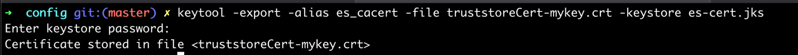

# How to connect to kafka/eventstreams using ACE


### Use case: 
---------
-   Save JSON data from a rest api to event streams

### Steps 

1.  [Create a topic in Event Streams and download the certificate](#1-EventStreams)
2.  [Create an ace flow - Flow to save data to EventStreams using rest api](#2-ACE-flow-in-the-toolkit)
3. [Deploy the bar file on CP4I and generate a secret](#3-Deploy-the-bar-file-on-CP4I)
4. [Test](#4-Test)
---------------

## 1. EventStreams


1\. Click on "Create a topic" and name \"ace\". Select 3 partitions and
leave rest the default.


2\. Click on the "connect to this topic" -\> Generate API Key

Create an api with the name \"ace\_api\" and DOWNLOAD JSON.


3\. Download Java truststore file


## 2. ACE flow in the toolkit
--------------------------

1\. Create a Rest API project by clicking File -\> New -\> REST API and
Name the project as \"Example\"


2\. Click on \"+\" under Resources and select POST and name the path as
\"producer\"


3\. Save

4\. Click on the button below to add a subflow 

4\. Add subflow and the following nodes


"Out" from kafkaProducer node should go to output


"Failure" from kafkaProducer node should go to Trace Exceptions!


Click on KafkaProducer -\> Under Properties -\> Select Basic and fill in
your information.

For example:
- Topic Name: ace
- Bootstrap servers:
    es-1-ibm-es-proxy-route-bootstrap-eventstreams.apps.ocp43.vg.gse-ocp.net:443


Under Security
- Security Protocol: Select SASL\_SSL
- SSL protocol: TLSv1.2


4\. Configure Trace Exceptions as below


5\. Save

SAVE THE FLOW AS A BAR FILE

File -\> NEW -\> BAR File


Name it as \"aceToKafka\" and click Finish

-   Select your project "Example"
-   Select Compile and in-line resources
-   Build and Save


## 3. Deploy the bar file on CP4I
------------------------------

Go to your CP4I ace dashboard

1\. Click Create Server -\> Click Add a bar file


Go to your workspace -\> BARfiles -\> Select kafkaToMongoDB.bar -\>
Click Continue


2\. Download configuration package on your desktop


3\. Open the config.tar.gz

Move the java truststore file (es-cert.jks) and api key
(es-api-key.json) here.

4\. Run
```
keytool -list -storetype JKS -keystore es-cert.jks -storepass password -v
```

To show the content of the jks file (password is password)


Get the alias name from the above output

Use that alias to run the below command:
```
keytool -export -alias es_cacert -file truststoreCert-mykey.crt -keystore es-cert.jks
```



5\. Open truststorePassword.txt in the config folder. Add your
truststore password:
```
password
```
Save


6\. Open setdbparms.txt and add the following:

```
kafka::KAFKA token <api_key>
IntSvr::truststorePass thisispwdfortruststore password
```

-   Make sure you keep the text "thisispwdfortruststore" exactly how it
    is mentioned above. The text "thisispwdfortruststore" is a
    placeholder. Since we are using truststore certificate we don't need
    to pass in username so instead we are using random text as a
    placeholder.


Copy the api\_key from the es-api-key.json and paste next to token


7\. Open serverconf.yaml and add following:
```
---
ResourceManagers:
    JVM:
    truststoreType: 'JKS'
    truststoreFile: '/home/aceuser/ace-server/truststore.jks'
    truststorePass: 'IntSvr::truststorePass'
```


------------------- Important --------------------

RENAME serverconf.yaml to server.conf.yaml

------------------- Important --------------------

8\. Create a secret - Go to openshift and copy the login command - Login
to openshift through command line - Go to the "config" directory through
command line

Make sure you are in the same namespace/project as your deployed ACE
Dashboard and your ace image.

RUN ./generateSecrets.sh \<secret-name\>

For example,
```
oc project ace

./generateSecrets.sh ace-kafka-secret
```


Go back to CP4I


Select Toolkit and click Next


- Name: ace-kafka
- Turn show everything option to ON
- Uncheck production usage
- Image pull secret -- the secret that was created during the installation of ace

```
cp-entitlement
```


-   Name of the secret that contains the server configuration:
```
ace-kafka-secret
```
- List of key aliases for the keystore: mykey
- List of certificate aliases for the truststore: mykey
- And leave rest the default


## 4. Test
-------

Open the server named kafkamongodb on ace dashboard and get the URL


create data.json with the following:
```
{"hello":"world"}
```
```
curl -X POST <base-url>/producer -d @ data.json
``` 

Example:
```
curl -X POST http://ace-kafka-http-ace.apps.ocp43.vg.gse-ocp.net/example/v1/producer -d @ data.json
```

or you can test using postman


You can see the message in your event streams topic


