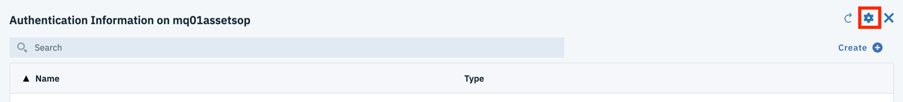
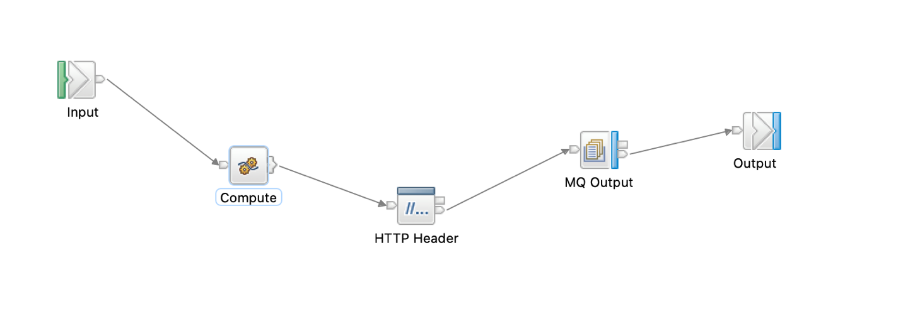

#  How to setup connection from ACE to MQ

## Use case: Save JSON data from a rest api to MQ
## Steps
1.  [Setup MQ](#1-Setup-MQ)
2.  [Create a flow in ACE](#2-ACE-flow)
3.  [Deploy the bar file on CP4I](#3-Deploy-the-bar-file-on-CP4I)
4.  [Test](#4-Test)


## 1. Setup MQ
--------

Select queue manager and the select properties:


On the Communication tab, find the CHLAUTH Records property and make it
Disabled


Click on Add widget button on top-right\...


\...and add Queues widget


Click on Create to create new Queue


Select Local queue type and and give it a name NEWORDER.MQ

Queue gets successfully created as follows:


Add Channels widget

**Note:** The next step to create channel can be skipped since it has
been already created.

Click on Create to create a new channel **ACE.TO.MQ**


\... call it **ACE.TO.MQ**, select **Server-connection** channel type


Select the channel and click Properties


On the **MCA tab**, for **MCA User ID** specify **mqm**


Click Add widget again and select Authentication Information widget


Click on the cogwheel to configure the widget



\... and select **System objects: Show**

Select SYSTEM.DEFAULT.AUTHINFO.IDPWOS and then click Properties


On the User ID + password tab, for both Local connections and for Client
connections specify None


-   Select Save and Close
-   Select queue manager again and click on \"three dots\" icon, the
    select \"Refresh security\"


Click on Connection authentication


**Note:** You have now completed the step to create the MQ
queue **NEWORDER.MQ** & the MQ channel **ACE.TO.MQ** and configured
security.

Confirm MQ Listener port

-   Still in MQ Console, add Listeners widget


Configure widget to see system objects


Select System objects: Show


Check the value of SYSTEM.LISTENER.TCP.1 (default is 1414)


Navigate to OpenShift console, select **mq** project and the select
Networking \> Services

Select the service whose name starts with the queue manager name and has
extension \'-ibm-mq\'. For example, the service in this case is
mq-01-assets-op-ibm-mq

Note:
-   We can access the listener from the outside of the cluster using the
    cluster proxy host name and this port by creating a route.
-   However, if we are accessing the mq inside the cluster, we can use
    \<service\_name\>.mq.svc.cluster.local for the host name and target
    listener port which is 1414. For example, mq-01-assets-op-ibm-mq.mq.svc.cluster.local

**Note:** You have now completed the step to inspect the MQ connection
information. It will be used in the next for configuring MQ Client.

From MQ that we just created, we will need the following information for
ACE

In this case,

-   Hostname: mq-01-assets-op-ibm-mq.mq.svc.cluster.local

-   Port: 1414

-   Queue name: NEWORDER.MQ

-   Channel Name: ACE.TO.MQ

-   Queue Manger: mq01assetsop

## 2. ACE flow
----------------

Open ACE toolkit

File -\> New -\> REST API


Name it MQdemo and click Finish


Add Resources by clicking the + symbol

Select POST method

Name the path: /msg


File -\> Save

Now Add a subflow under the /msg resources that you just created


Add nodes like below



Add Compute configuration


Double click on compute node and add the following code:

Compute node - Only saves the accountid and orderid
```
    CREATE COMPUTE MODULE New_Order_Compute
        CREATE FUNCTION Main() RETURNS BOOLEAN
        BEGIN
            Set OutputRoot.JSON.Data.accountid = InputRoot.JSON.Data.accountid;
            Set OutputRoot.JSON.Data.orderid = SUBSTRING(CAST(CURRENT_TIMESTAMP AS CHARACTER) AFTER '.' FOR 6);
            RETURN TRUE;
        END;
        CREATE PROCEDURE CopyMessageHeaders() BEGIN
            DECLARE I INTEGER 1;
            DECLARE J INTEGER;
            SET J = CARDINALITY(InputRoot.*[]);
            WHILE I < J DO
                SET OutputRoot.*[I] = InputRoot.*[I];
                SET I = I + 1;
            END WHILE;
        END;
        CREATE PROCEDURE CopyEntireMessage() BEGIN
            SET OutputRoot = InputRoot;
        END;
    END MODULE;
```
Add HTTP header node properties


Add MQ output node properties from MQ that we just created

In this case,

-   Hostname: mq-01-assets-op-ibm-mq.mq.svc.cluster.local

-   Port: 1414

-   Queue name: NEWORDER.MQ

-   Channel Name: ACE.TO.MQ

-   Queue Manger: mq01assetsop


Save it as a bar file

To save it as a bar file:

File -> New -> Bar File

Name it as: MQdemo

Select the project and the necessary options to build and save the bar


File -> Save

## 3. Deploy the bar file on CP4I
-----------------------------------

Go to ace dashboard and click on "Create Server"


Upload the bar file: MQdemo


Select Toolkit and hit Next


Turn "Show everything" to ON

Now fill out the helm chart

-   **Helm release name**: mq-demo
-   Uncheck Production usage if its not production
-   **Image**: App Connect Enterprise with MQ client
-   **Image pull secret**: cp-entitlement (the secret for your image)

Click Create


## 4. Test
------------

Go to ACE dashboard


Copy the REST API Base URL

```
{
    "accountid": "B-10000",
    "order": {
        "orderDate": "2004-01-19T04:25:25.938Z",
        "contractId": "00000100",
        "orderDetails": [
            {
                "lineItemNumber": 1,
                "productId": "AJ1-05",
                "quantity": "20"
            }
        ]
    }
}
```

Go to postman or curl the post request\


You should be able to see a message in MQ
